

  

<h1 align = "center">🌟LilyGo-Modem-Series🌟</h1>

# News

- 2025/09/19 : Added SIM7070G support, compatible with SIM7080G
- 2025/08/07 : Completed support for SIM7080G series
- 2025/07/26 : Add **T-SimShield** support, please refer to the [document](./docs/SimshieldUsageGuide/SimshieldUsageGuide.md) here for quick setup
- 2025/07/10 : The example has completed most of the support for SIM7000G. For non-encrypted MQTT, please refer to the description above the example. Some of them are not supported.
- 2025/07/09 : Completed support for SIM7600 series
- The TinyGSM used in the example is a [fork](https://github.com/lewisxhe/TinyGSM) to support A7670,A7608,SIM7672G,SIM7670G, If you use the master branch, the compilation will not go smoothly

> \[!IMPORTANT]
> If you encounter a problem during use, first check whether the modem's current firmware version is the latest, and then search for [issues](https://github.com/Xinyuan-LilyGO/LilyGo-Modem-Series/issues) to see if there are similar issues.
>

## ESP32 Version Get Started

<table style="width: 100%; border-collapse: collapse; text-align: center; border: 0; border-spacing: 0;">
  <tr style="border: 0;">
    <!-- T-A7670X -->
    <td style="padding: 10px 20px; width: 33.33%; border: 0; background: transparent;">
      <a href="./docs/en/esp32/a7670-esp32/REAMDE.MD" style="text-decoration: none; display: block;">
        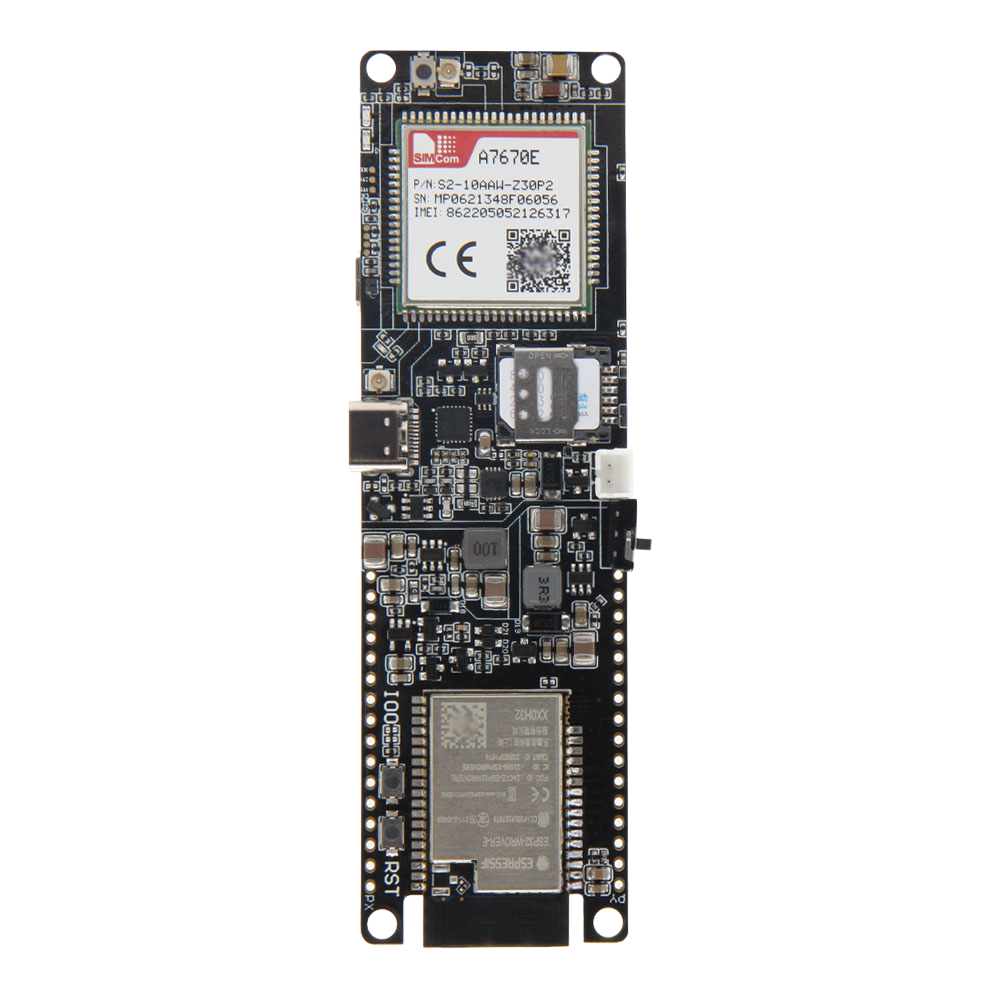
        
T-A7670X Quick Start

      </a>
    </td>
    <!-- T-A7608X -->
    <td style="padding: 10px 20px; width: 33.33%; border: 0; background: transparent;">
      <a href="./docs/en/esp32/a7608-esp32/REAMDE.MD" style="text-decoration: none; display: block;">
        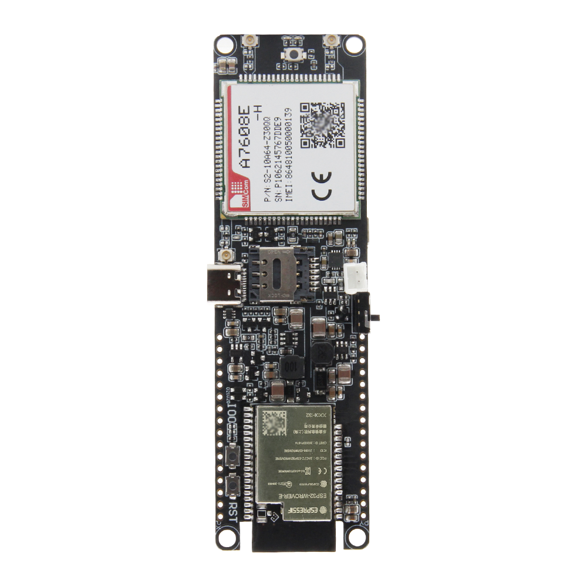
        
T-A7608X Quick Start

      </a>
    </td>
    <!-- T-SIM7000G -->
    <td style="padding: 10px 20px; width: 33.33%; border: 0; background: transparent;">
      <a href="./docs/en/esp32/sim7000-esp32/REAMDE.MD" style="text-decoration: none; display: block;">
        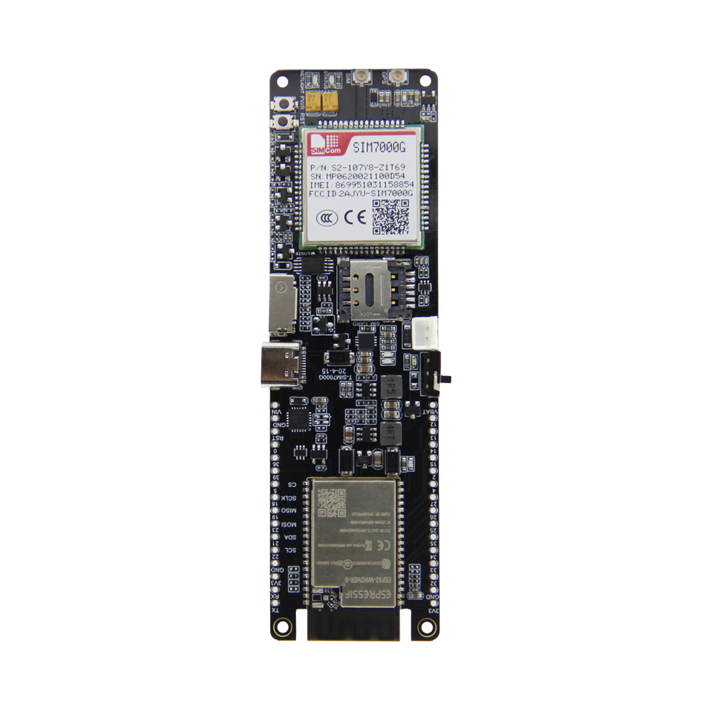
        
T-SIM7000G Quick Start

      </a>
    </td>
  </tr>
</table>

<table style="width: 100%; border-collapse: collapse; text-align: center; border: 0; border-spacing: 0; margin: 20px 0;">
  <tr style="border: 0;">
    <!-- T-SIM7070G-ESP32 -->
    <td style="padding: 10px 20px; width: 33.33%; border: 0; background: transparent;">
      <a href="./docs/en/esp32/sim7070-esp32/REAMDE.MD" style="text-decoration: none; display: block;">
        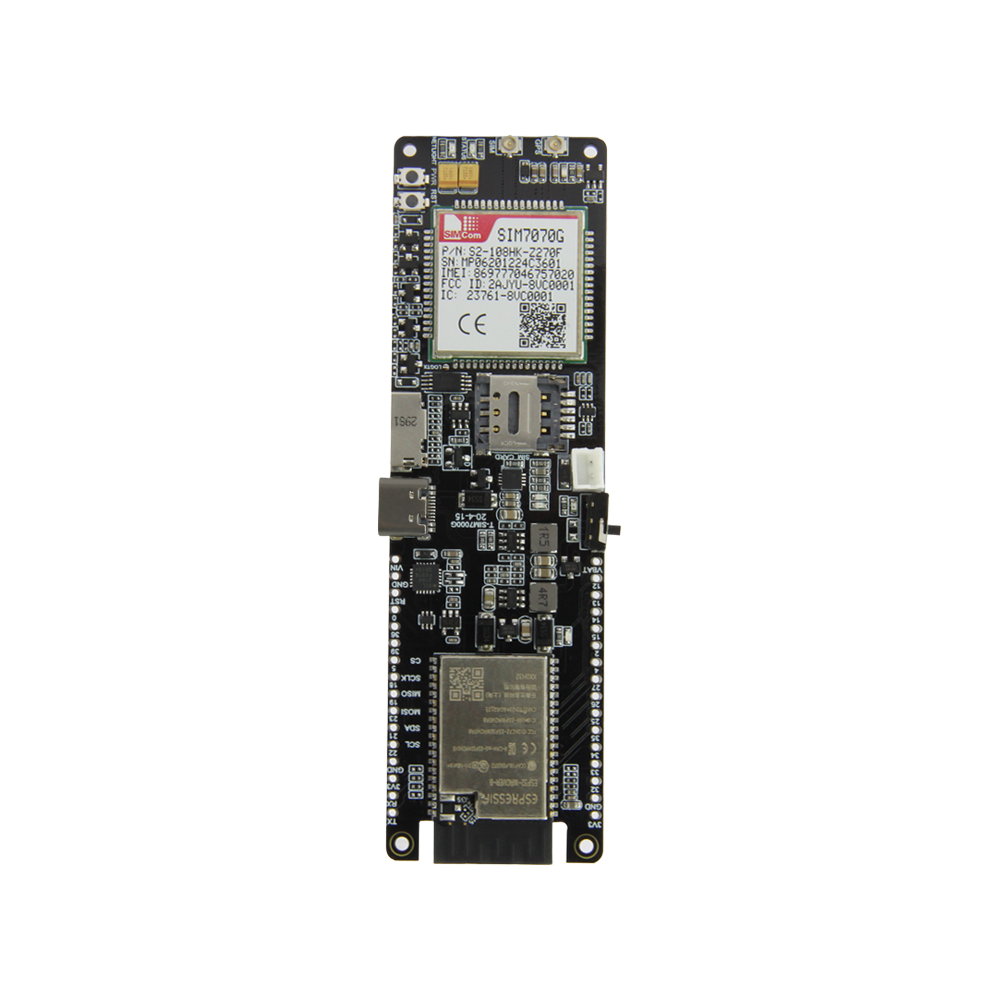
        
T-SIM7070G Quick Start

      </a>
    </td>
    <!-- T-SIM7600X -->
    <td style="padding: 10px 20px; width: 33.33%; border: 0; background: transparent;">
      <a href="./docs/en/esp32/sim7600-esp32/REAMDE.MD" style="text-decoration: none; display: block;">
        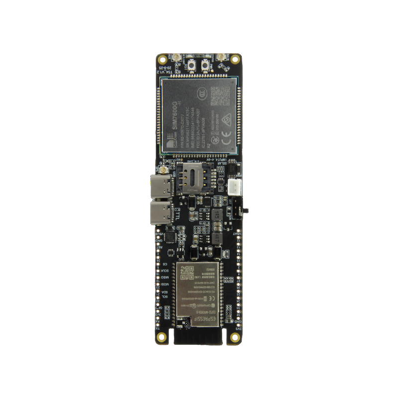
        
T-SIM7600X Quick Start

      </a>
    </td>
    <!-- T-Call-A7670X -->
    <td style="padding: 10px 20px; width: 33.33%; border: 0; background: transparent;">
      <a href="./docs/en/esp32/t-call-a7670x/REAMDE.MD" style="text-decoration: none; display: block;">
        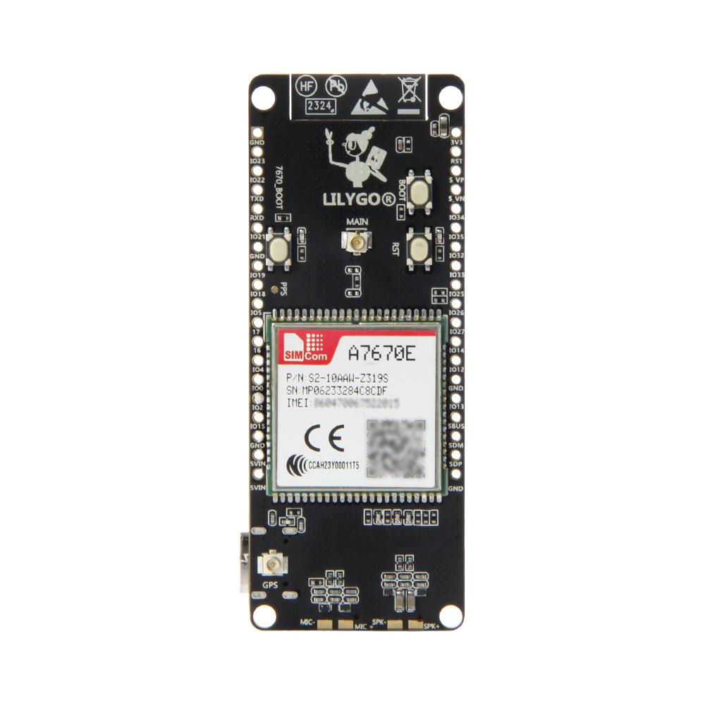
        
T-Call-A7670X Quick Start

      </a>
    </td>
  </tr>
</table>

<table style="width: 100%; border-collapse: collapse; text-align: center; border: 0; border-spacing: 0; margin: 20px 0;">
  <tr style="border: 0;">
    <!-- T-PCIE-Series -->
    <td style="padding: 10px 20px; width: 100%; border: 0; background: transparent;">
      <a href="./docs/en/esp32/pcie-series-esp32/REAMDE.MD" style="text-decoration: none; display: block;">
        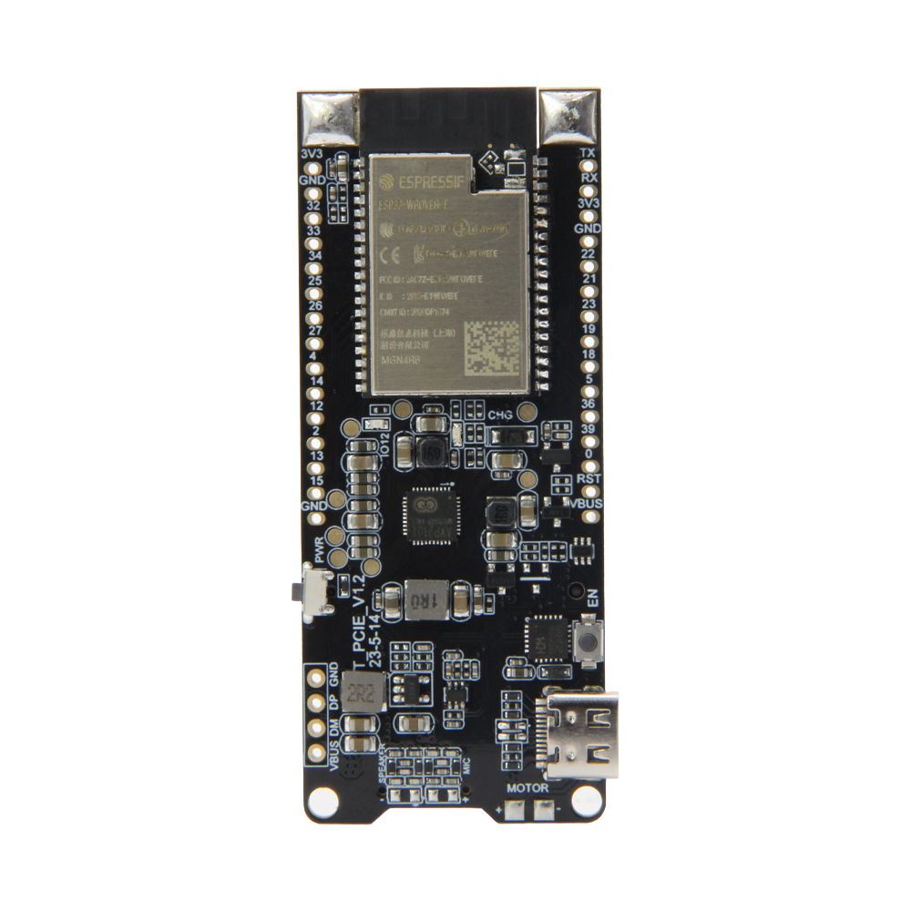
        
T-PCIE-Series Quick Start

      </a>
    </td>
  </tr>
</table>

## ESP32S3 Version Get Started

<table style="width: 100%; border-collapse: collapse; text-align: center; border: 0; border-spacing: 0; margin: 20px 0;">
  <tr style="border: 0;">
    <!-- T-A7608-S3 -->
    <td style="padding: 10px 20px; width: 50%; border: 0; background: transparent;">
      <a href="./docs/en/esp32s3/a7608x-s3/REAMDE.MD" style="text-decoration: none; display: block;">
        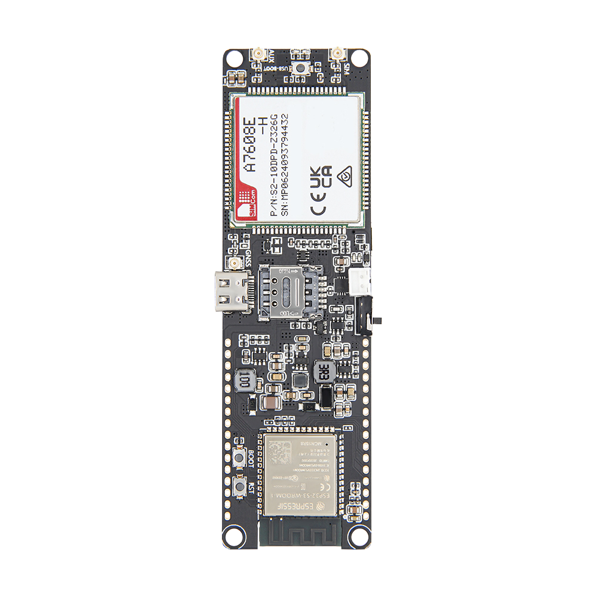
        
T-A7608X-ESP32S3 Quick Start

      </a>
    </td>
    <!-- T-SIM7670G-ESP32S3 -->
    <td style="padding: 10px 20px; width: 50%; border: 0; background: transparent;">
      <a href="./docs/en/esp32s3/sim7670g-s3/REAMDE.MD" style="text-decoration: none; display: block;">
        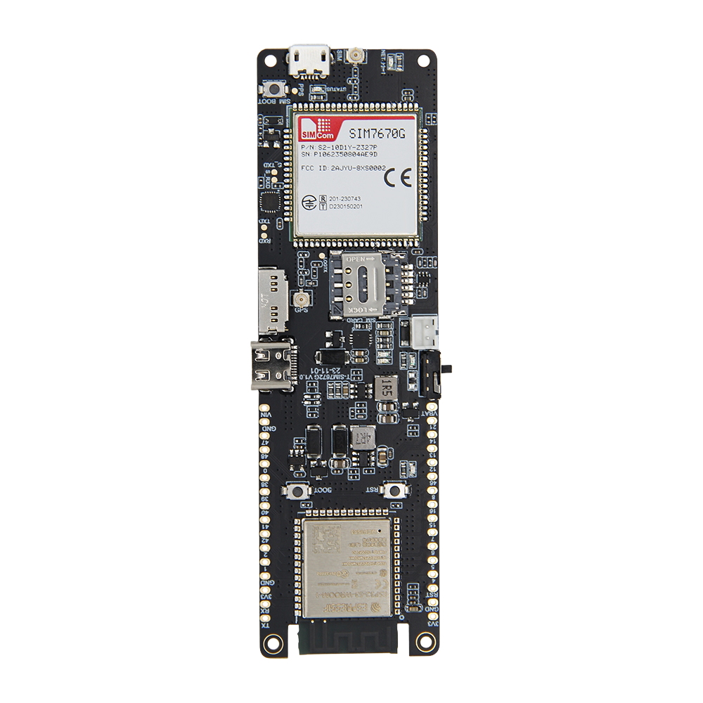
        
T-SIM7670G-ESP32S3 Quick Start

      </a>
    </td>
  </tr>
</table>

## ESP32S3 Version Standard Series Get Started

<table style="width: 100%; border-collapse: collapse; text-align: center; border: 0; border-spacing: 0; margin: 20px 0;">
  <tr style="border: 0;">
    <!-- T-A7670X-S3-Standard -->
    <td style="padding: 10px 20px; width: 33.33%; border: 0; background: transparent;">
      <a href="./docs/en/esp32s3/a7670x-s3-standard/REAMDE.MD" style="text-decoration: none; display: block;">
        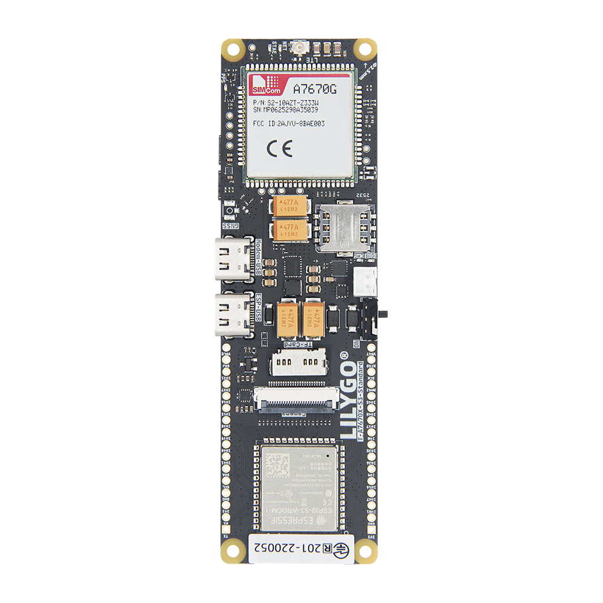
        
T-A7670X-S3-Standard Quick Start

      </a>
    </td>
    <!-- T-SIM7670G-S3-Standard -->
    <td style="padding: 10px 20px; width: 33.33%; border: 0; background: transparent;">
      <a href="./docs/en/esp32s3/sim7670g-s3-standard/REAMDE.MD" style="text-decoration: none; display: block;">
        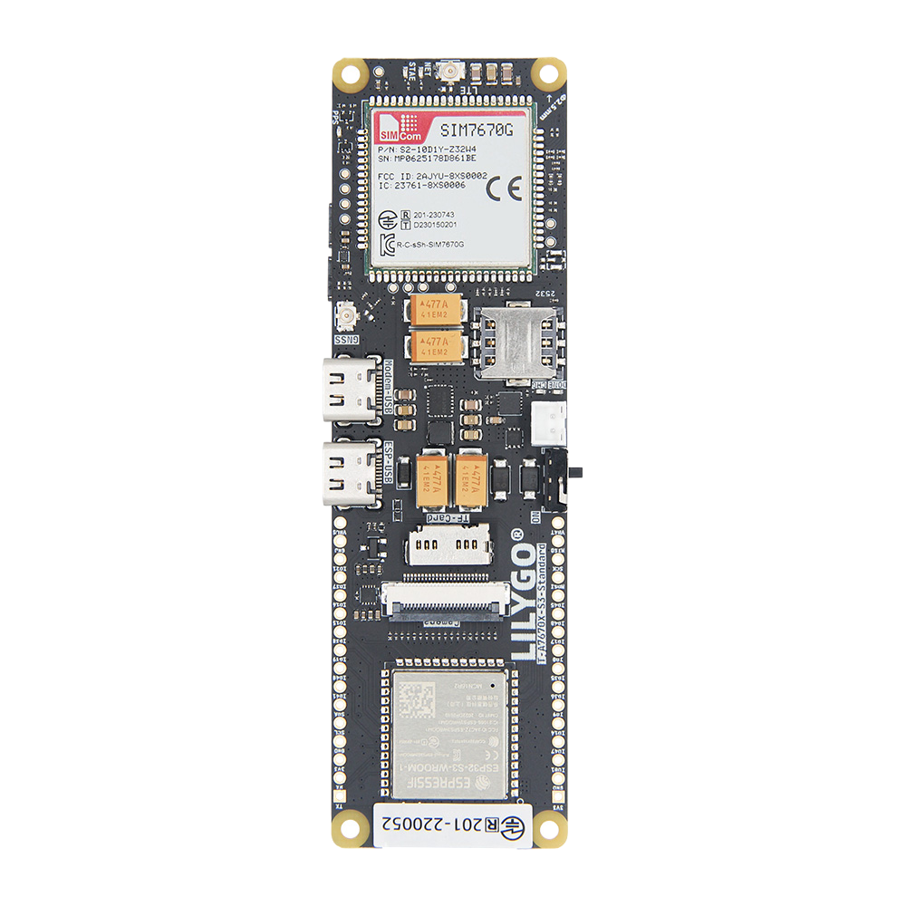
        
T-SIM7670G-S3-Standard Quick Start

      </a>
    </td>
    <!-- T-SIM7000G-S3-Standard -->
    <td style="padding: 10px 20px; width: 33.33%; border: 0; background: transparent;">
      <a href="./docs/en/esp32s3/sim7000g-s3-standard/REAMDE.MD" style="text-decoration: none; display: block;">
        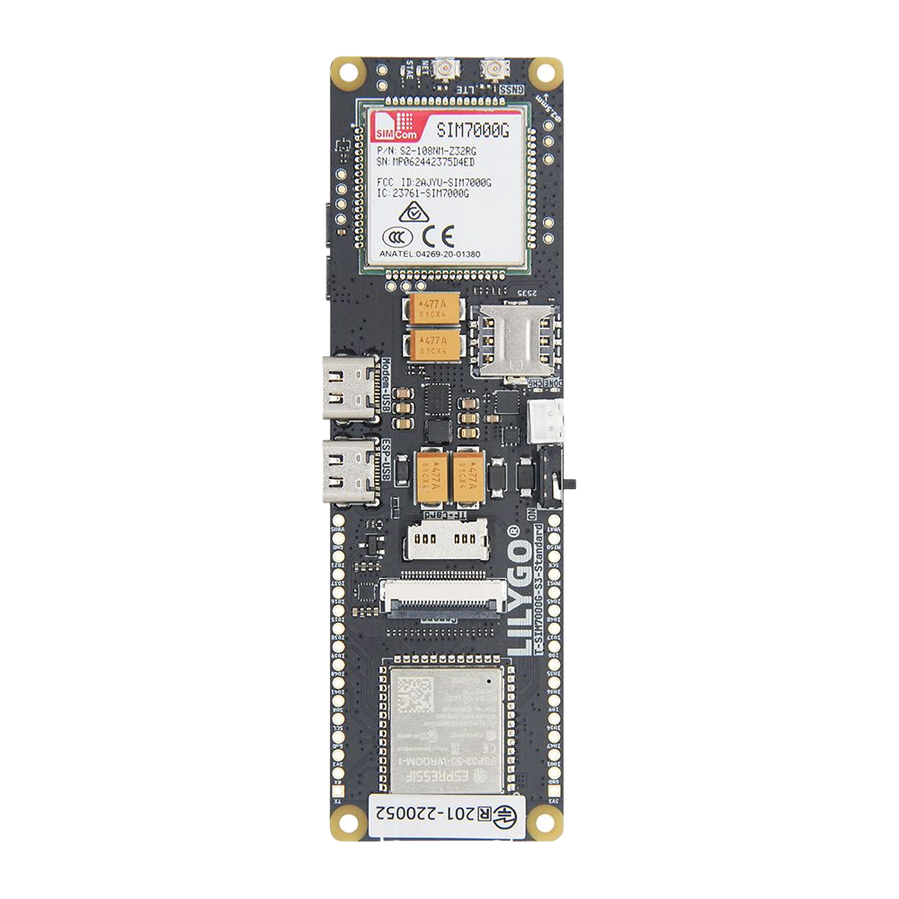
        
T-SIM7000G-S3-Standard Quick Start

      </a>
    </td>
  </tr>
</table>

<table style="width: 100%; border-collapse: collapse; text-align: center; border: 0; border-spacing: 0; margin: 20px 0;">
  <tr style="border: 0;">
    <!-- T-SIM7080G-S3-Standard -->
    <td style="padding: 10px 20px; width: 100%; border: 0; background: transparent;">
      <a href="./docs/en/esp32s3/sim7080-s3-standard/REAMDE.MD" style="text-decoration: none; display: block;">
        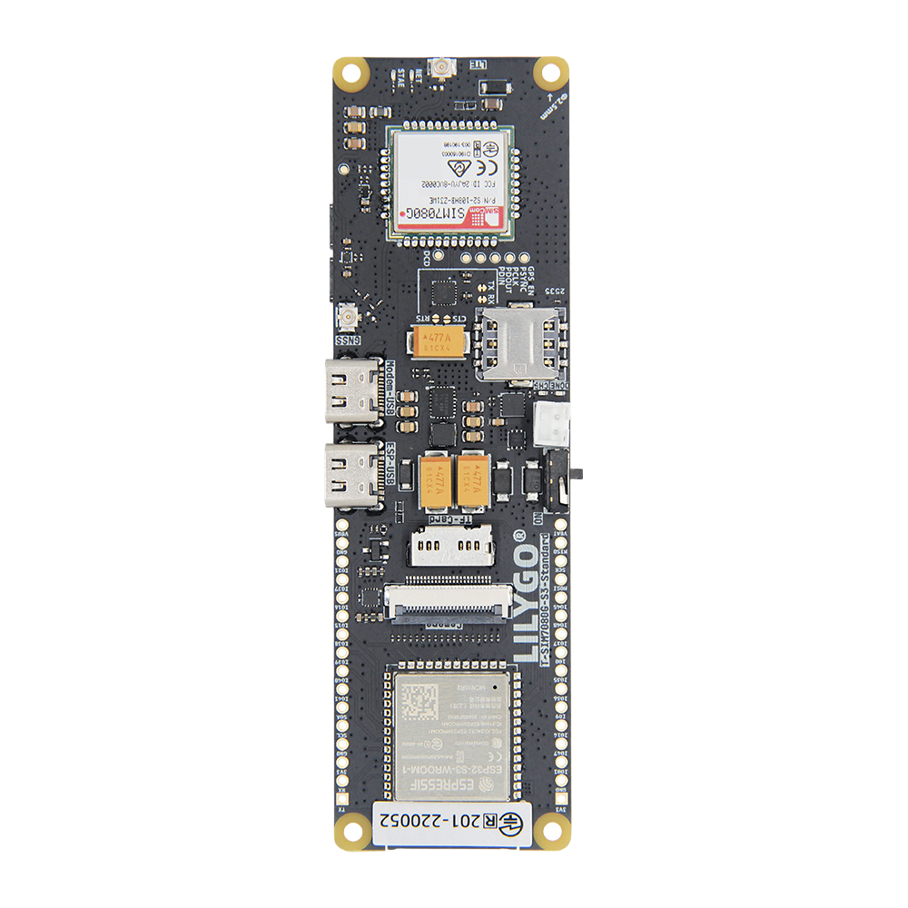
        
T-SIM7080G-S3-Standard Quick Start

      </a>
    </td>
  </tr>
</table>

## T-SimShield Usage Guide

<table style="width: 100%; border-collapse: collapse; text-align: center; border: 0; border-spacing: 0; margin: 20px 0;">
  <tr style="border: 0;">
    <!-- SimShield -->
    <td style="padding: 10px 20px; width: 100%; border: 0; background: transparent;">
      <a href="./docs/en/SimshieldUsageGuide/README.md" style="text-decoration: none; display: block;">
        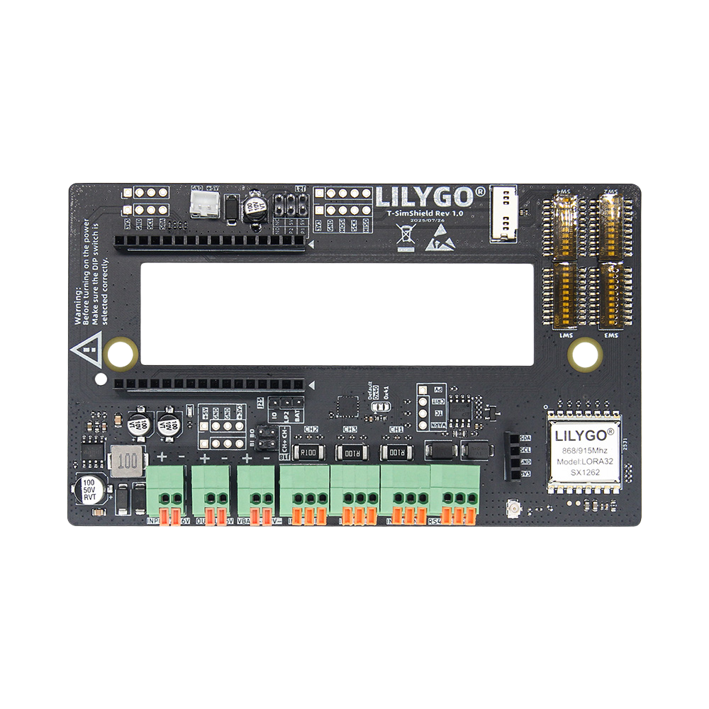
        
SimShield Usage Guide

      </a>
    </td>
  </tr>
</table>
<!-- - 🔧 **[SimShield Usage Guide](./docs/en/SimshieldUsageGuide/README.md)** -->

## Modem firmware Upgrade Guide

- 🔧 **[A7670/A7608 Upgrade Guide](./docs/update_fw.md)**
- 🔧 **[SIM7670G Upgrade Guide](./docs/en/upgrade/sim7670g/sim7670g_upgrade.md)**
- 🔧 **[SIM7000G Upgrade Guide](./docs/en/esp32/sim7000-esp32/upgrade/sim7000_upgrade.md)**
- 🔧 **[SIM7080G Upgrade Guide](./docs/en/esp32s3/sim7080-s3-standard/upgrade/README.MD)**
- 🔧 **[SIM7600X Upgrade Guide](./docs/en/esp32/sim7600-esp32/upgrade/sim7600_upgrade.md)**

## Model Comparison

- ⁉️ **[Differences between different versions and models](./docs/model_comparison.md)**

## Modem firmware bug summary

- 🐞 **[Modem firmware bug summary](./docs/simcom_firmware_bug.md)**
