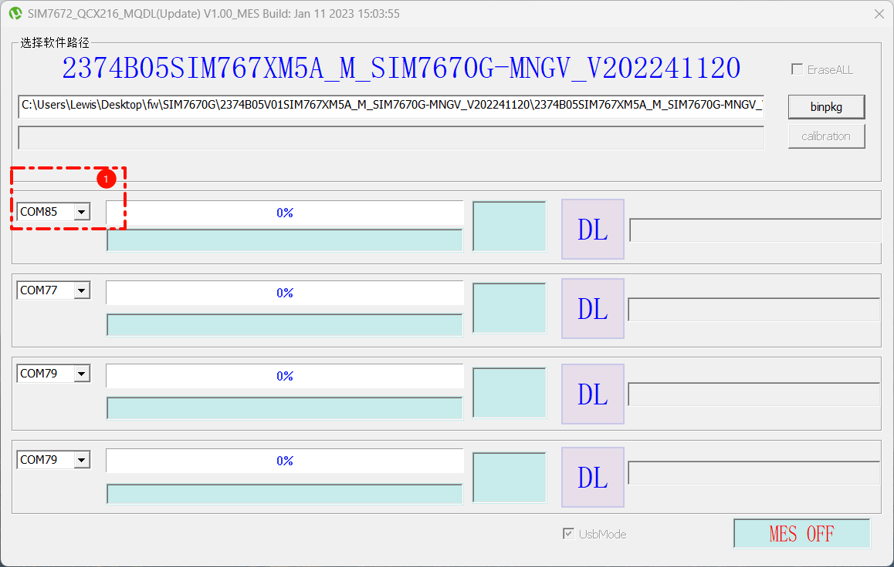
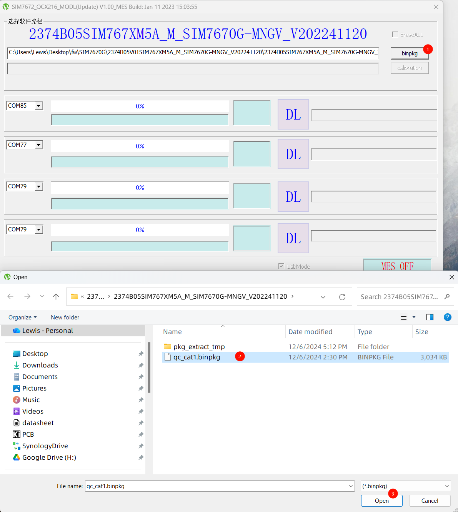

  

<h1 align = "center">🌟LilyGo SIM7670G Upgrade Guide🌟</h1>

## Resources

### `0` SIM7670G Firmware Update Guide Video

- [💠SIM7670G Firmware Update Guide Video](https://youtu.be/wTcMp0K8fXY)

### `1`Flash Tools

- [SIM7670G FlashTools](https://drive.google.com/file/d/1-CHQOXQhCJRr1S8rP_AGHVWGqE823wem/view?usp=sharing)
- [SIM7670G UpgradeTools](https://drive.google.com/file/d/19M-_COv_gkZ9KBwzqfWTWWJSYUEjOK8-/view?usp=sharing)

> \[!IMPORTANT]
> Please do not use older versions of Flash Tools, as they are unable to select the port on some computers.

### `2`Driver

- [SIM7670G Driver](https://drive.google.com/file/d/1-SlbQ9FUZzov96Xc74SJ375U9v1JVjma/view?usp=sharing)

### `3`Firmware

<!-- * ~~[SIM7670G B02](https://drive.google.com/file/d/1-63xiw4TbGwHi3rQDzJpPKwp2SDNPXC1/view?usp=sharing) Known HTTP 715 Errors Don't use this version~~  -->
- [🟡2374B03SIM767XM5A](https://drive.google.com/file/d/1bBrze2eDtrjEuJ_2yiufSo87eIk_mYkE/view?usp=sharing) <!-- 20241008 Update Fixed  HTTP 715 error-->
- [🟡2374B04SIM767XM5A](https://drive.google.com/file/d/1-akwKQJttLbtLD48ApagusfBvS9ixZ4F/view?usp=sharing)
- [🟢 Stabilize:2374B05V01SIM767XM5A](https://drive.google.com/file/d/10VvMNzgKhAX25lHSIGHnD3ip7kWjFl0g/view?usp=sharing) <!-- 20241206 Fixed MQTTS error https://github.com/Xinyuan-LilyGO/LilyGO-T-A76XX/issues/183 , HTTPS MQTTS FIXED -->
- [🟣 Latest: 2388B03SIM767XM5A](https://drive.google.com/file/d/1_Gwj3v_6NCtC-6xQ8dGSrjayTFRJyVgu/view?usp=sharing)

> \[!IMPORTANT]
>
> Note: If the software update doesn't occur within the specified time, the modem will automatically exit update mode. At this point, you need to press and hold the modem's BOOT button to enter download mode again.
>

# Update steps

1. Determine the ESP32's USB port number. Check it in the Device Manager. Connect only to the ESP32's Type-C port and write it down.

2. Write [ATDebug](../../../../../examples/ATdebug/ATdebug.ino) and send `AT+SIMCOMATI` to check the current firmware version.

3. Disconnect the ESP32's USB port from the computer.

4. Connect the MicroUSB port (the SIM7670G-S3 series uses MicroUSB; the SIM7670G-S3-Standard series uses Modem-USB).

5. Press and hold the modem's boot button (the SIM7670G-S3 series has the BOOT button near the MicroUSB port; the SIM7670G-S3-Standard series has the BOOT button on the back of the modem).

6. Connect the ESP32 Type-C port.

7. Check the modem's port number in the Device Manager; it will be different from the ESP32's.

8. Select the firmware file to be upgraded in the software.

9.  Open the upgrade tool and select the modem's port number.

10. Unplug the ESP32's Type-C cable, then reconnect it. The upgrade will automatically begin.
